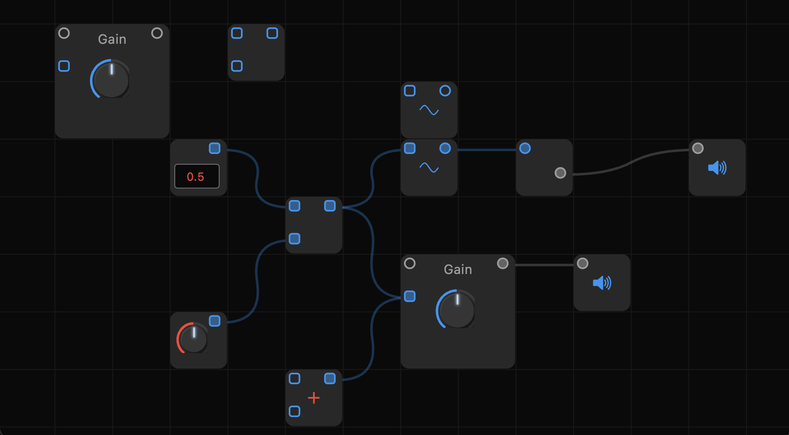

<i>this project is in pre-release and is only partially working; check here for updates</i>
<h1 align="center">
   
  
   
  Procedure
   
</h1>

<h4 align="center">A procedural audio editor built on top of <a href="https://cmajor.dev" target="_blank">cmajor</a>.</h4>

  
  
  
  

  <a href="#features">Features</a> •
  <a href="#download">Download</a> •
  <a href="#build">Build</a> •
  <a href="#credits">Credits</a> •
  <a href="#support">Support</a> •
  <a href="#other">Other</a>

## Pre-Release Todo

* Repository
  * Fix dependencies
  * Clean up unused files
  * Reorganize directories
  * Add license
  * Squash history and make public
* Home
  * Setting user interface
  * Projects browser
  * Audio/Plugins/Accounts buttons
* Patch Editor
  * Preset browser
  * Node selection
  * Node adding and deleting
  * Pins
  * Infinite scroll
* Building
  * CI/CD for all platforms
  * Manually test on all platforms
  * Add automated tests
* Project exporting
* LLM module generation
  * Subscription for LLM integration

### State Management

- List of nodes and connectors
- Form patch by adding node/connector one at a time
- Serialization
  - On click save

## Download

## Build

## Credits

## Support

## Other
